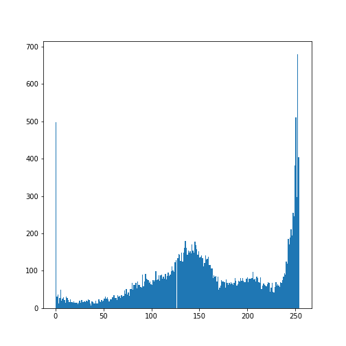
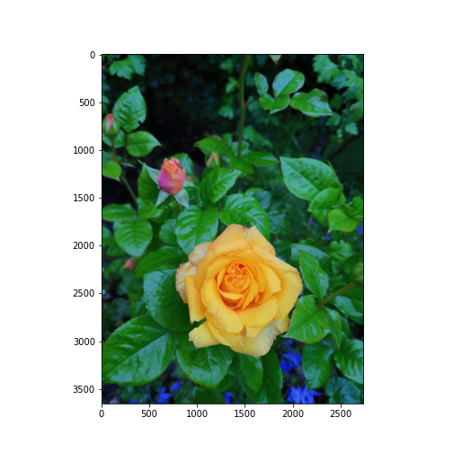

[**Download Chapter notebook (ipynb)**](02-section2.ipynb)

:::::::::::::::::::::::::::::::::::::: questions 

- How an image is read in Python?
- What does masking work?

::::::::::::::::::::::::::::::::::::::::::::::::

::::::::::::::::::::::::::::::::::::: objectives

- Explaining data in images
- Understanding image masking 

::::::::::::::::::::::::::::::::::::::::::::::::

## Image Handling 

### **Reading and Processing Images**
In biology, we often deal with images, for example from microscopy and different medical imaging modalities. In many cases, we wish to extract some quantitative information from these images. The focus of this session is to read and process images in Python. This includes:

- Working with 2-dimensional images
- Creating and applying binary image masks
- Working with 2-dimensional colour images, and interpreting colour channels

In this notebook, we want to be able to read an image into our Python enviroment, from our computer. 

In order to this, we will use Matplotlib’s image module, from which we will import the function `imread`. This allows us to store the image in a variable, which we will call image. The function `imread` can interpret many different image formats, including jpg, png and tif images.

In order for this notebook to run smoothly, please make sure that "Cerebellum.jpg" is in a subfolder called `figs` in your current folder.  


```python
from matplotlib.image import imread
```

```output
Matplotlib is building the font cache; this may take a moment.
```


```python
image = imread('fig/Cerebellum.jpg')
```

Next, we can display the image within the editor. To do this, we import a function called subplots und use `imshow()` to display the image. 

:::::::::::::: callout
## Note
Note the semicolon at the end of the call of `ax.imshow(image);` - this suppresses the output, and ensures that only the image is displayed.
::::::::::::::

### **Display Image**


```python
from matplotlib.pyplot import subplots, show

fig, ax = subplots()

ax.imshow(image);

show()
```


Our image is a colour image. A gray image only needs a single intensity value for each pixel. Typical RGB colour images contain three channels which correspond to red, green and blue (RGB) intensities. The resulting colour is conferred as a result of compositing the intensities of these three channels over the area of a single pixel.

### **Pixels and Pixel Intensities**

To check the number of pixels in our image we use the `shape` function (without any parentheses).


```python
image.shape
```

```output
(154, 327, 3)
```

This shows that the image contains 156 x 327 pixels (horizontal by vertical) organised in three layers. 

The intensities are stored as integers that range between 0 (black or no intensity) to 255 (white or full intensity).

To access the information in a single pixel, we use square brackets containing two values corresponding to the pixel's horizontal and vertical coordinates.

For example, the pixel in the top left corner would be accessed, as follows:


```python
image[0, 0]
```

```output
array([255, 255, 255], dtype=uint8)
```

All three values are maximal: i.e. the pixel will appear white.

Experiment by plotting a section of the image. This is done by specifying pixel values over a range of positions. For example, in order to see the rectangle defined by pixels 50 to 70 (horizontally) and 60 to 100 (vertically), we can use:


```python
fig, ax = subplots()

ax.imshow(image[50:70, 60:100]);

ax.set_xticklabels(());
ax.set_yticklabels(());

show()
```


Note that this preserves the original colours of the image. 

A peculiarity of the Matplotlib graphic library is that `imshow` typically uses a default colour map, if none is specified. Thus, we use the keyword `cmap` to specify what colour map to use, if we want to change this. 

Here is how we can see the intensities of a single channel. The colon indicates that all numbers in the range are displayed for x and y coordinates (i.e. the full horizontal and vertical dimensions of the image), and the third value is the channel (out of RGB) that we wish to display. 

In the below example, we will specify the third value in the square brackets. Out of indices 0 (red), 1 (green) and 2 (blue), we will display just the blue channel, as follows:


```python
blue = 2

fig, ax = subplots()

ax.imshow(image[:,:, blue], cmap='gray');

show()
```


This gray image now shows the intensities of the 'blue' channel. Dark pixels correspond to a low intensity, where brighter ones correspond to a higher intensity value.

### **Treating Intensities as Data**

As pixel intensities are simply numerical values, we can deal with them using Python as we would with any numbers. 

For example, we can infer means and standard deviations, and use these to perform statistical analyses of the pixel intensities:


```python
from numpy import mean, std

image_mean = mean(image)
image_std  = std(image)

print('Mean of Intensities:              ', round(image_mean, 2))
print('Standard deviation of Intensities: ', round(image_std, 2))
```

```output
Mean of Intensities:               220.0
Standard deviation of Intensities:  61.46
```

You could also plot the distribution of these intensities as a histogram. Here we plot the distribution of the blue layer. 

In order to specify to Matplotlib that it must look at all values (not just a single row of pixels in the image), we use a function called `ravel()`, which flattens the image:


```python
fig, ax = subplots()

ax.hist(image[:, :, blue].ravel(), bins=256);

show()
```


This is not too informative: the distribution is distorted by the fact that most intensities are 255 (white). 

We can adjust this by telling Matplotlib to only take values that are smaller than 255:


```python
fig, ax = subplots()

ax.hist(image[:, :, blue][image[:, :, blue] < 255].ravel(), bins=256);

show()
```



:::::::::::::::: challenge
## Exercise: 

Import another picture and check its 

- type (gray or color)

- range of intensities (either 0 to 255, or 0 to 1)

- histogram
::::::::::::::::

## Masking

The technique of specifying a condition to select or filter the intensities in zn image - as we did when displaying the histogram - is termed **masking**. 

We can use masking as a simple way to detect objects in an image, based on pixel intensity data: 


```python
photo = imread('fig/rose.jpg')

fig, ax = subplots()

ax.imshow(photo);

show()
```



We will assume that the 'rose' in the picture contains the strongest red intensities. Let us therefore take a look at the histogram of the red channel.


```python
red = 0

fig, ax, = subplots()

ax.hist(photo[:, :, red].ravel(), bins=500);

show()
```


Observing this histogram, we might suspect that intensities below 100 correspond to the background, and that the intensities above, for example, a value of 150 correspond to the rose. We can check this by filtering the intensities, accordingly.

First, we must define a threshold and display the filtered histogram. It is easier if we assign the filter to a variable. We can call this variable `mask`.


```python
threshold = 100

mask = photo[:, :, red] > threshold

fig, ax, = subplots()

ax.hist(photo[:, :, red][mask].ravel(), bins=500);

show()
```


The mask gives us the values where red (and also yellow) parts of the photo are intense. We can thus use this information to turn the rest of the photograph to black. It is done with a function called `invert` which turns "True" to "False", and vice versa. 

Before we do that, let us create a copy such that the original remains intact, and we do not overwrite it.


```python
from numpy import invert

photo_copy = photo.copy()

photo_copy[invert(mask), :] = 0


fig, ax = subplots()

ax.imshow(photo_copy);

show()
```


```python
fig.savefig('fig/photo_copy.png', format='png')
```


:::::::::::::::::::::::::::::::::::::keypoints 

- `imread()` is a Matplotlib function to import images.
- `ravel()` is a Numpy function to flatten multi-dimensional arrays to a one-dimensional array.
- Masking refers to the selection or filtering of specified parts of an array by logical expression.

::::::::::::::::::::::::::::::::::::::::::::::::
[r-markdown]: https://rmarkdown.rstudio.com/
