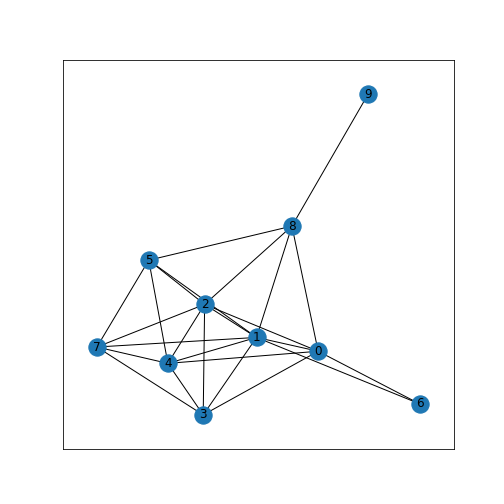
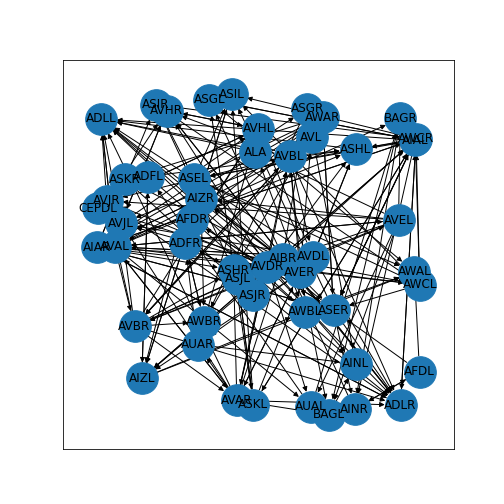

[**Download Chapter notebook (ipynb)**](04-section4.ipynb)

:::::::::::::::::::::::::::::::::::::: questions 

- How are graphs represented?
- How are graphs visualised?
- How can graphs be quantitatively analysed?

::::::::::::::::::::::::::::::::::::::::::::::::

::::::::::::::::::::::::::::::::::::: objectives

- Understanding the notion of a graph
- Explaining nodes and edges of a network
- Visualising graphs in different layouts

::::::::::::::::::::::::::::::::::::::::::::::::

## Introduction to Networks

In this lesson, we will build and represent networks in Python using __NetworkX__ package.

NetworkX is a Python package for the creation, manipulation, and study of the structure, dynamics, and functions of complex networks.

To use NetworkX and visualise your networks, you can import the whole package.


``` python
import networkx as nx
```

### **Nodes and Edges**

Nodes are the fundamental units of a network. They are linked to other nodes by edges, which show the way(s) in which the nodes are connected or related to one another. In principle, any object, person, cell or brain region can be a node.

The goal of network science is to obtain a representation of connections or interactions between nodes, by using graphs. 

Let’s start by creating an empty graph object, and adding some nodes to it.


``` python
firstGraph = nx.Graph()

firstGraph.add_node('Node A')
firstGraph.add_node('Node B')
firstGraph.add_node('Node C')

print(firstGraph.nodes)
```

``` output
['Node A', 'Node B', 'Node C']
```

We have created a graph called firstGraph, added three nodes, and then printed a list of the nodes in this graph. So far, these nodes have no relationship to each other. To specify relationships (representing e.g. interactions) we can add edges to show how the nodes are connected.


``` python
firstGraph.add_edge('Node A', 'Node B')
firstGraph.add_edge('Node A', 'Node C')
firstGraph.add_edge('Node B', 'Node C')

print(firstGraph.edges)
```

``` output
[('Node A', 'Node B'), ('Node A', 'Node C'), ('Node B', 'Node C')]
```

Here we created edges between Nodes A and B, A and C, and B and C, and printed a list of these edges. At this stage, our graph has three nodes and three edges. 

### **Visualising networks**

Using the basic graph (firstGraph) that we created, we can begin by visualising it. In NetworkX, we can use function `draw_networkx`.


``` python
from matplotlib.pyplot import show

nx.draw_networkx(firstGraph)

show()
```


To change the size and the colour of the node symbols:


``` python
nx.draw_networkx(firstGraph, node_size=2000, node_color='r')

show()
```


### **Complex Networks**

Typically, networks are not set up node by node. Here is an example of a function that creates a fully connected network with a pre-specified number of nodes: all possible edges between the nodes are realised.


``` python
nodes = 10

Graph = nx.complete_graph(nodes)

layout = nx.circular_layout(Graph)

nx.draw_networkx(Graph, pos=layout)

show()
```


And here is network where connections are drawn randomly but with a pre-defined probability, a random network.


``` python
edge_probability = 0.5

ER = nx.erdos_renyi_graph(nodes, edge_probability, seed=123)

layout = nx.spring_layout(ER)

nx.draw_networkx(ER, pos=layout)

show()
```



Change the edge probability and see how the network changes.


``` python
edge_probability = 0.1

ER = nx.erdos_renyi_graph(nodes, edge_probability, seed=123)

layout = nx.spring_layout(ER)

nx.draw_networkx(ER, pos=layout)

show()
```


## The C. elegans Neuron Network

Using the above concepts, we can now have a look at the neuron network of C. elegans.

[Introduction to C elegans neurons](http://www.wormbook.org/chapters/www_celegansintro/celegansintro.html#sec5.4)

[C elegans neurons in the worm atlas](https://www.wormatlas.org/hermaphrodite/nervous/Neuroframeset.html)

<p style='text-align: justify;'>
Caenorhabditis elegans (C. elegans) is a nematode used as model organism to study developmental biology, and specifically neuronal development. It is one of the simplest organisms with a nervous system, which makes it particularly suited for this research. The complete connectome (neuronal map) has been published, originally by White, Southgate, Thomson, and Brenner in 1986, and continues to be researched. 
</p>

<p style='text-align: justify;'>
In this section we are going to use some simplified data from the Dynamic Connectome lab on the neuronal networks of C. elegans. For simplicity, these data have been edited such that only the first 50 of the 131 documented neurons are included. The Python Pandas library is used to import this data. 
</p>

To analyse and display the neural network of C. elegans, we take neurons to represent __nodes__ and synapses to represent __edges__ of a network. 

### **Import Connectivity Data and Labels**
<p style='text-align: justify;'>
The information is provided in the form of a so-called network or connectivity matrix. The matrix shows how neurons connect to each other. We can import the connectivity matrix from the file `celegans131matrix_50.csv`. To find out how many neurons it represents, we check using `len`. 
</p>


``` python
from pandas import read_csv

data = read_csv('data/celegans131matrix_50.csv', header=None, dtype = "int")

neurons = data.to_numpy()

len(neurons)
```

``` output
50
```

This is a connectivity matrix for 50 neurons. To display the matrix, we can use the Matplotlib function `imshow()`.


``` python
from matplotlib.pyplot import subplots, show

fig, ax = subplots()

im = ax.imshow(neurons);

fig.colorbar(im, ticks=(0, 1), shrink=0.5);

show()
```


Each yellow square (representing "1") indicates a connection from the neuron with the index in the rows to a neuron with the index in the columns. 
<p style='text-align: justify;'>
Next, we import the labels and convert the resulting dataframe into a dictionary using function `to_dict`. This is a complex Python array, where the index of each neuron is associated with the name of it. The function `to_dict` wraps the dictionary within a dictionary and therefore indexing is used to access the `inner` dict.
</p>


``` python
neuron_Names = read_csv('data/celegans131labels_50.csv', header=None)

neuronNames = neuron_Names.to_dict()

neuronLabels = neuronNames[0]

print(neuronLabels)
```

``` output
{0: 'ADFL', 1: 'ADFR', 2: 'ADLL', 3: 'ADLR', 4: 'AFDL', 5: 'AFDR', 6: 'AIAL', 7: 'AIAR', 8: 'AIBR', 9: 'AINL', 10: 'AINR', 11: 'AIZL', 12: 'AIZR', 13: 'ALA', 14: 'ASEL', 15: 'ASER', 16: 'ASGL', 17: 'ASGR', 18: 'ASHL', 19: 'ASHR', 20: 'ASIL', 21: 'ASIR', 22: 'ASJL', 23: 'ASJR', 24: 'ASKL', 25: 'ASKR', 26: 'AUAL', 27: 'AUAR', 28: 'AVAL', 29: 'AVAR', 30: 'AVBL', 31: 'AVBR', 32: 'AVDL', 33: 'AVDR', 34: 'AVEL', 35: 'AVER', 36: 'AVHL', 37: 'AVHR', 38: 'AVJL', 39: 'AVJR', 40: 'AVL', 41: 'AWAL', 42: 'AWAR', 43: 'AWBL', 44: 'AWBR', 45: 'AWCL', 46: 'AWCR', 47: 'BAGL', 48: 'BAGR', 49: 'CEPDL'}
```

### **C. elegans Network Display**

The connectivity matrix can directly be converted to a Networkx graph.

- First, a Graph object is created, `neuronGraph`

- Second, a network layout is specifided, `neurinLayout`

- Third, the network is plotted with function`draw_networkx`


``` python
neuronGraph  = nx.from_numpy_matrix(neurons, 
                                    create_using=nx.DiGraph)   

neuronLayout = nx.random_layout(neuronGraph, seed=12)

nx.draw_networkx(neuronGraph, neuronLayout, 
        node_size=1000,
        labels=neuronLabels)
        
show()        
```



The network can be displayed in different layouts, for instance circular:


``` python
neuronGraph  = nx.from_numpy_matrix(neurons, 
                                    create_using=nx.DiGraph)   

neuronLayout = nx.circular_layout(neuronGraph)

nx.draw_networkx(neuronGraph, neuronLayout, 
        node_size=1000,
        labels=neuronLabels)
show()        
```


### **Quantitative Analysis**
Quantitative analysis of the network is also possible. For instance, we can plot the number of connections that each neuron has:


``` python
fig, ax = subplots()

ax.plot(dict(neuronGraph.degree).values(), '-o');
ax.set_xlabel('Index');
ax.set_ylabel('Degree');

show()
```


## Anatomical Mapping
<p style='text-align: justify;'>
File `celegans131positions_50.csv` contains information on how the nodes relate to each other in 2-D space. Because in neuroscience, the spatial position in an organism or in the brain is crucial for interpretation, we can include positional information to replace the arbitrary layout of the networks.
</p>


``` python
neuronPos = read_csv('data/celegans131positions_50.csv', header=None)

neuronPos.items
```

``` output
<bound method DataFrame.items of            0         1
0   0.082393 -0.000984
1   0.083279 -0.003184
2   0.082639 -0.013035
3   0.083279 -0.011512
4   0.086329 -0.002706
5   0.086463 -0.000980
6   0.065177  0.009346
7   0.059030  0.011512
8   0.075441  0.006123
9   0.061980 -0.006149
10  0.061969 -0.003429
11  0.048698  0.002706
12  0.057560  0.003184
13  0.094056 -0.013227
14  0.069112  0.000492
15  0.071767 -0.000735
16  0.077966 -0.007625
17  0.080095 -0.010287
18  0.075507  0.000492
19  0.078380 -0.000980
20  0.076982 -0.012789
21  0.077156 -0.011757
22  0.063455  0.006641
23  0.062704  0.009063
24  0.088542 -0.010084
25  0.088668 -0.009553
26  0.068620  0.006149
27  0.067113  0.005389
28  0.089526  0.001722
29  0.090872 -0.000245
30  0.069112 -0.004427
31  0.071767 -0.006368
32  0.061734 -0.001476
33  0.066378 -0.001470
34  0.082885  0.002214
35  0.084014  0.003184
36  0.072063 -0.008608
37  0.076421 -0.012737
38  0.067636 -0.009346
39  0.072992 -0.009798
40  0.060990  0.009063
41  0.077966 -0.002951
42  0.078380 -0.005389
43  0.079196 -0.003935
44  0.082789 -0.006858
45  0.078458  0.004919
46  0.078625  0.004164
47  0.112890  0.000492
48  0.114630  0.003184
49  0.094199 -0.016233>
```


``` python
nx.draw_networkx(neuronGraph, neuronPos.values,
        node_size=1000,
        labels=neuronLabels)
show()
```


``` python
new_pos = neuronPos.copy()
new_pos.values[:, 0] = -1*neuronPos.values[:, 0]

nx.draw_networkx(neuronGraph, new_pos.values,
        node_size=1000,
        labels=neuronLabels)
show()        
```


The two BAG nodes to the right of the display are the [sensory neurons used to monitor oxygen and carbon dioxide](https://www.wormatlas.org/neurons/Individual%20Neurons/BAGframeset.html).

Here is some background:
[BAG genes, functions and connections](http://wormweb.org/neuralnet#c=BAG&m=1)

The graph display is in Matplotlib and can be handled as such. E.g. for possible Node shapes see:
https://matplotlib.org/stable/api/markers_api.html#module-matplotlib.markers. 

If you have a multi-panel figure, specify the axes for the network with keyword argument `ax`:


``` python
fig, ax = subplots(figsize=(14, 8), ncols=2)

nx.draw_networkx(neuronGraph, neuronLayout, 
        node_size=1000,
        labels=neuronLabels,
        ax=ax[0])

nx.draw_networkx(neuronGraph, neuronPos.values,
        node_shape='H',
        node_color='tomato',
        node_size=1300,
        labels=neuronLabels,
        ax=ax[1])

ax[0].set_title('Circular view of C elegans network');
ax[1].set_title('Anatomical view of C elegans network');

show()
```


This concludes out short introduction to networks in the context of neurocsience. Importantly, edges or relationships can also be deduced an a purely functional basis, i.e. even if there is no physical connection between nodes. This is currently one of the most active field of research. 

:::::::::::::::::::::::::::::::::::::keypoints 

- Python package NetworkX is designed to set up and study graphs.
- `draw_networkx` is a NetworkX function to visualise graphs.
- Connectivity information is stored in the connectivity (adjacency) matrix.

::::::::::::::::::::::::::::::::::::::::::::::::
[r-markdown]: https://rmarkdown.rstudio.com/
