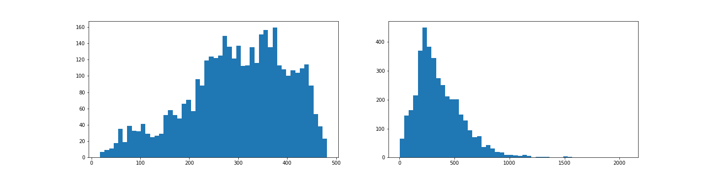
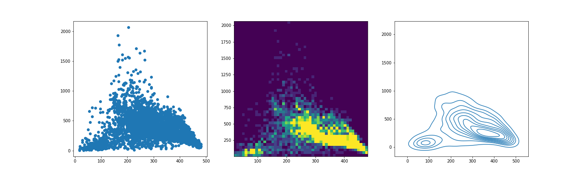

[**Download Chapter notebook (ipynb)**](05-section5.ipynb)

:::::::::::::::::::::::::::::::::::::: questions 

- What is NiBabel?
- How NiBabel used to import neuro-images?
- How is machine learning applied to image data?

::::::::::::::::::::::::::::::::::::::::::::::::

::::::::::::::::::::::::::::::::::::: objectives

- Installing and using NiBabel Python Library
- Understanding data pre-processing
- Segmenting images with Gaussian Mixture Models

::::::::::::::::::::::::::::::::::::::::::::::::


## NiBabel Image Library

Firstly, if you haven't already installed NiBabel on your command line, please do so in this notebook by uncommenting and running the code in the cell below.

```
# conda install -c conda-forge nibabel
```

Let's begin by importing the nibabel package. Here we are importing it as `nib` - an abbreviation of our choosing to access the package's functions more easily in our code. You can use any abbreviation that you like; just remember to call it correctly in any subsequent code that you write.


``` python
import nibabel as nib
```

:::::::::::::::::::::: callout
## Note
Note how we import the NiBabel package as `nib`. You can use any abbreviation to access the package’s functions from within your programme.

To familiarise yourself with the NiBabel package, try the [Getting started tutorial](https://nipy.org/nibabel/gettingstarted.html) using an example image file.

::::::::::::::::::::::

### **Load images and get data**

NiBabel has its own import function `load()`. Let's load in our image, and assign this to a variable.


``` python
img_nibabel = nib.load("data/T1_mask.nii")

type(img_nibabel)
```

``` output
<class 'nibabel.nifti1.Nifti1Image'>
```

The `header` lets you see any metadata that is associated with the image.


``` python
meta_info = img_nibabel.header

print(meta_info)
```

``` output
<class 'nibabel.nifti1.Nifti1Header'> object, endian='<'
sizeof_hdr      : 348
data_type       : b''
db_name         : b''
extents         : 0
session_error   : 0
regular         : b'r'
dim_info        : 0
dim             : [  3 128 128  70   1   1   1   1]
intent_p1       : 0.0
intent_p2       : 0.0
intent_p3       : 0.0
intent_code     : none
datatype        : float32
bitpix          : 32
slice_start     : 0
pixdim          : [-1.   2.   2.   2.2  0.   0.   0.   0. ]
vox_offset      : 0.0
scl_slope       : nan
scl_inter       : nan
slice_end       : 0
slice_code      : unknown
xyzt_units      : 10
cal_max         : 0.0
cal_min         : 0.0
slice_duration  : 0.0
toffset         : 0.0
glmax           : 0
glmin           : 0
descrip         : b'5.0.11'
aux_file        : b''
qform_code      : scanner
sform_code      : scanner
quatern_b       : 0.0
quatern_c       : 1.0
quatern_d       : 0.0
qoffset_x       : 125.5061
qoffset_y       : -109.38977
qoffset_z       : -86.742615
srow_x          : [ -2.       0.       0.     125.5061]
srow_y          : [   0.         2.         0.      -109.38977]
srow_z          : [  0.         0.         2.2      -86.742615]
intent_name     : b''
magic           : b'n+1'
```


``` python
print(meta_info.get_xyzt_units())
```

``` output
('mm', 'sec')
```

With `get_fdata()` the image intensities can be converted to a Numpy array.


``` python
img1 = img_nibabel.get_fdata()

img1.shape
```

``` output
(128, 128, 70)
```


``` python
img_nibabel = nib.load("data/b0_mask.nii")

img2 = img_nibabel.get_fdata()
```

We now import a second image with same spatial resolution, but additional information from another imaging modality.


``` python
img_nibabel = nib.load("data/b0_mask.nii")

img2 = img_nibabel.get_fdata()

img2.shape
```

``` output
(128, 128, 70)
```

For simpler handling, we only select a two-dimensional slice from each 3D image.

### **Plot Images**


``` python
img_slice = 30

img1_slice = img1[:, :, img_slice]
img2_slice = img2[:, :, img_slice]
```


``` python
from matplotlib.pyplot import subplots, show

fig, ax = subplots(ncols=2, figsize=(15, 5))

f1 = ax[0].imshow(img1_slice, cmap="gray")
f2 = ax[1].imshow(img2_slice, cmap="gray")

fig.colorbar(f1, ax=ax[0]);
fig.colorbar(f2, ax=ax[1]);

ax[0].set_xlabel('T1 Image', fontsize=16);
ax[1].set_xlabel('B0 Image', fontsize=16);

show()
```


In order to check how similar the images are, we can compare their intensity histograms.

### **Histograms**

``` python
mask = (img1_slice>0) & (img2_slice>0) 

img1_nz = img1_slice[mask]
img2_nz = img2_slice[mask]

fig, ax = subplots(nrows=1, ncols=2, figsize=(20, 5))

ax[0].hist(img1_nz, bins=50);
ax[1].hist(img2_nz, bins=50);

show()
```



These two images appear to have different, potentially complementary information.

### **Visualise and Concatenate**

We can visualise the intensity data in a scatter plot, a two-dimensional histogram, and a kernel density contour plot from the Seaborn library. For the Seaborn library, [see documentation:](https://seaborn.pydata.org) 

Here is the [documentation for the kernel density plot:](https://seaborn.pydata.org/generated/seaborn.kdeplot.html)

Here are the plots:


``` python
fig, ax = subplots(1, 3, figsize=(20, 6))

# Scatter plot
ax[0].scatter(img1_nz, img2_nz)

# 2D Histogram
ax[1].hist2d(img1_nz, img2_nz, bins=50, vmax=10);

from seaborn import kdeplot

# Density Plot
kdeplot(x=img1_nz, y=img2_nz, ax=ax[2]);

show()
```



The scatter plot (left) shows a distorted, noisy distribution but too many valuess seem to be on top of each other. The 2D histogram (centre) shows two regions (yellow) with large counts. The kernel density plot (right) confirms two regions of high density. 

For Machine Learning, the data need to be in a single two-dimensional array. Rows denote pixels and (in our case) there are two columns for two images. Numpy function concatenate helps us to create the array in the correct form to apply machine learning algorithms. 


``` python
from numpy import concatenate

all_imgs = concatenate([img1_nz.reshape(-1,1), img2_nz.reshape(-1,1)], axis=1)

all_imgs.shape
```

``` output
(4009, 2)
```


## Gaussian Mixture Clustering
After the data preparation steps, we can proceed with our machine learning analysis.

We want to segment the images into different types of tissues. It is not obvious how to do this, as the intensity values in the above histograms are distributed without clear segmentation of intensities. We will nonetheless attempt to cluster the images using a Gaussian Mixture Model (GMM) algorithm.

The result of the clustering are predicted labels for each of the pixels (voxels in general), according to the tissue type which the algorithms assigns.

Here is the workflow:

1. Import the GMM class from the Python machine learning library __Scikit-learn__.

2. Decide the number of clusters that we expect to see.

3. Set a random seed to make the outcome reproducible.

4. Instantiate the clustering algorithm.

5. Use function `fit_predict` to fit the model to the data and obtain the labels for each pixel. 


``` python
from sklearn.mixture import GaussianMixture
```


``` python
n_components = 3

RANDOM_STATE = 12345

gmm = GaussianMixture(n_components=n_components, 
                      random_state=RANDOM_STATE)

all_img_labels = gmm.fit_predict(all_imgs)

all_img_labels[0]
```

``` output
1
```

We can now plot a scatter plot of the (predicted) labels to see their distribution.


``` python
fig, ax = subplots(figsize=(4, 4))

ax.scatter(img1_nz, img2_nz, c=all_img_labels, s=100)

ax.set_xlabel('Image 1', fontsize=16)
ax.set_ylabel('Image 2', fontsize=16);

show()
```


The yellow and green dots seem to indicate "objects" in the image. The purple dots are the remaining "other" pixels.

Now, we need to map the predicted labels from the "intensity space" back to the original image in its anatomical space. We find that the algorithm can pick up structures that can be identified as separate compartments in the image. 


``` python
from numpy import zeros

all_img_labels_mapped = zeros(img1_slice.shape)

all_img_labels_mapped[mask] = all_img_labels
```


``` python
fig, ax = subplots(figsize=(4, 4))

ax.imshow(all_img_labels_mapped);

show()
```


:::::::::::::::::::::::::::: challenge
## Exercise
Redo the above sequence of steps with different pre-assigned number of clusters and compare the results.

::::::::::::::::::::::::::::

:::::::::::::::::::::::::::::::::::::keypoints 

- NiBabel is a package to access various neuroimaging file formats.
- Object detection in neuro-images can be done using Gaussian Mixture Models (GMM) clustering.
- The `fit_predict` function fits a model to data and returns predicted labels for each data point.

::::::::::::::::::::::::::::::::::::::::::::::::
[r-markdown]: https://rmarkdown.rstudio.com/
